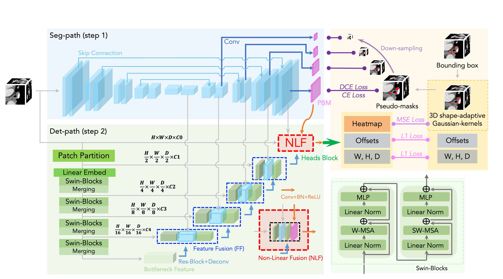
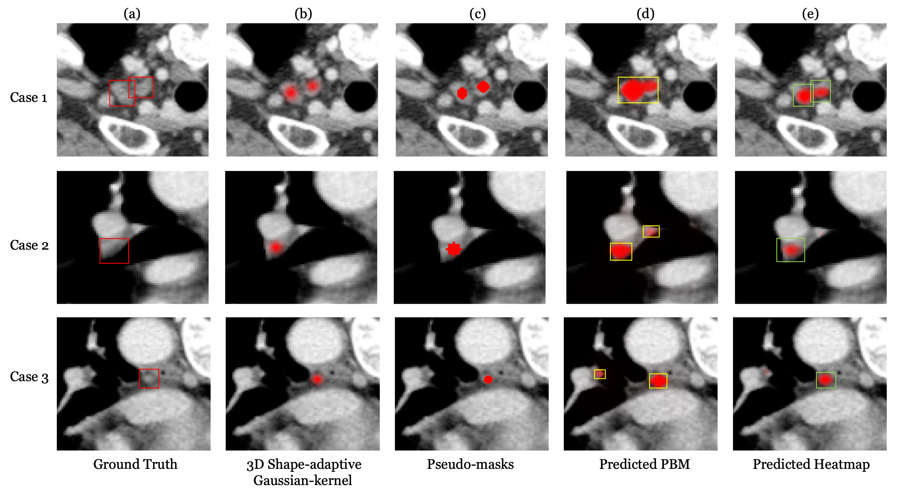

## SDF-Net+: A Hybrid Detection Network for Mediastinal Lymph Node Detection on Contrast CT Images

Accurate lymph node detection and quantification from CT images are crucial for cancer diagnosis, staging, treatment planning and prognosis. Detecting lymph nodes in the mediastinal area is challenging due to their low contrast, irregular shapes, and dispersed distribution.

We perform detection tasks on 3D contrast-enhanced CT images using bounding box ground truths. We use nnU-Net, the state-of-the-art segmentation model, as the first path, and then merge the detection path to get the final results, similar to a coarse-to-fine approach. Detailed information can be found in the paper.



The results show that the 3D shape-adaptive Gaussian kernel representation and peak selection rule effectively address the clustering problem. The use of the segmentation path better captures the shape of the lymph node and produces a coarse-to-fine result, making it more robust and leading to superior performance of our method.



## How to use it?

First, we use nnUNetv2 to train our in-house dataset for segmentation using pseudo-mask labels derived from bounding box ground truths. You can do it from [https://github.com/MIC-DKFZ/nnUNet/tree/master](https://).

Then get your nnUNet model path into the model in the models folder, and then to train the dettection path.

training:

```python
python train_v1.py
```

inference:

```
python evaluator_v1.py
```

### learning*

- All variables from all files should be placed into a single YAML file, which will make it easier for others to reproduce your work and facilitate collaboration between academia and industry.
- The code should be well-structured and appropriately commented. When writing code, consider its generality and reusability.
- The preprocessing, training, and inference processes should be organized separately and clearly. Write the README file in advance.
